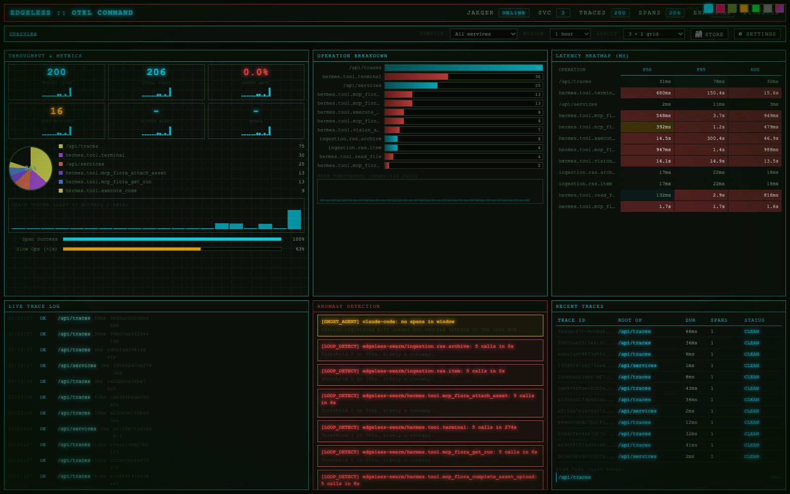

# EDGELESS OTEL Command

A cross-platform desktop observability dashboard for OpenTelemetry + Jaeger. Built with Electron.



## What It Is

Real-time monitoring of your agent swarm telemetry — tool calls, ingestion pipelines, anomaly detection, and trace visualization — in a native app with a retro-futuristic CRT aesthetic.

## Features

- **Real-time Jaeger integration** — polls your local Jaeger instance every 10s
- **Cross-platform** — macOS (.dmg), Windows (.exe installer), Linux (.AppImage, .deb)
- **Embedded proxy** — no separate server needed, CORS handled internally
- **Tray icon** — stays in your menu bar / system tray
- **Native feel** — custom title bar, no browser chrome
- **Scrollable panels** — every quadrant scrolls independently
- **Visuals** — donut charts, bar charts, heatmaps, waveforms, sparklines
- **Anomaly detection** — phantom stall, ghost agent, loop detection alerts

## Requirements

- [Jaeger all-in-one](https://www.jaegertracing.io/download/) running on `localhost:16687`
- Any OTel-instrumented service exporting to Jaeger

## Install

### macOS

Download `EDGELESS OTEL Command-x.x.x.dmg`, double-click, drag to Applications.

### Windows

Download `EDGELESS OTEL Command Setup-x.x.x.exe`, run installer.

### Linux

Download `EDGELESS OTEL Command-x.x.x.AppImage`, make executable:

```bash
chmod +x EDGELESS_OTEL_Command-x.x.x.AppImage
./EDGELESS_OTEL_Command-x.x.x.AppImage
```

## Build from Source

```bash
git clone https://github.com/edgeless-dev/edgeless-otel-command.git
cd edgeless-otel-command
npm install
npm run build:mac   # or :win, :linux, or :all
```

Outputs in `dist/`:

| Platform | Artifacts |
|----------|-----------|
| macOS | `.dmg`, `.zip` |
| Windows | `.exe` (NSIS installer), `.exe` (portable) |
| Linux | `.AppImage`, `.deb` |

## Configure Jaeger Endpoint

By default the app proxies to `http://localhost:16687`. To change:

```bash
# macOS / Linux
export OTEL_DASHBOARD_JAEGER=http://your-jaeger:16686

# Windows
set OTEL_DASHBOARD_JAEGER=http://your-jaeger:16686
```

Then restart the app.

## Architecture

```
Electron (main.js)
  ├── Embedded HTTP proxy (port 8766)
  │   ├── / → index.html (dashboard)
  │   └── /jaeger/* → Jaeger API
  ├── BrowserWindow (frameless, custom chrome)
  └── Tray icon (macOS) / Taskbar (Windows)
```

## License

MIT
